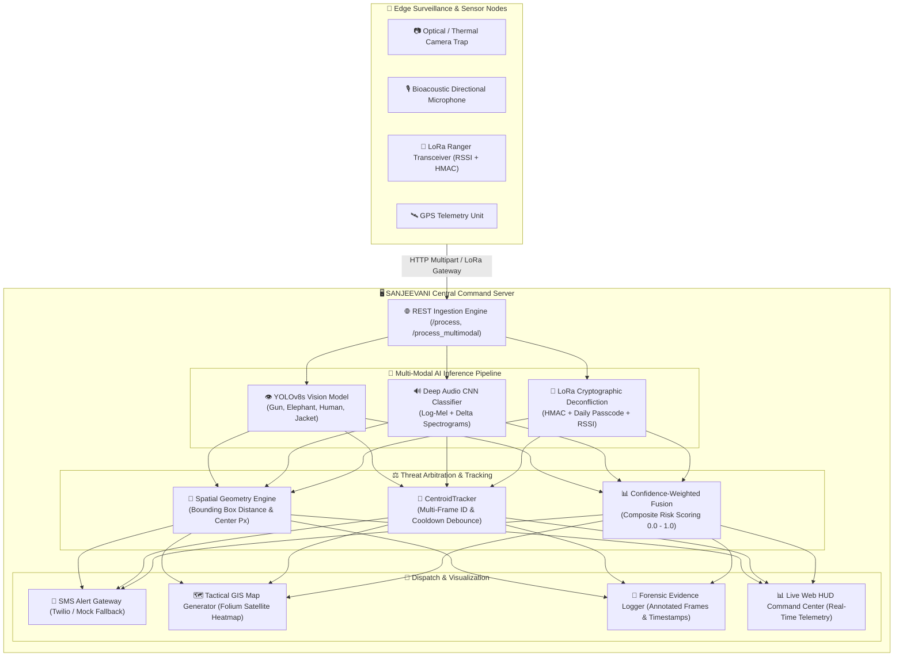

# 🌿 SANJEEVANI: AI-Based Real-Time Wildlife Poaching Detection System

[](https://www.python.org/)
[](https://pytorch.org/)
[](https://github.com/ultralytics/ultralytics)
[](https://flask.palletsprojects.com/)
[](https://www.docker.com/)
[](https://github.com/Katakam-Krupavathi/AI-Based-Real-Time-Wildlife-Poaching-Detection-System/actions)
[](#)

> **SANJEEVANI** is an autonomous, multi-modal IoT surveillance and early warning platform designed to protect endangered wildlife from illegal poaching incursions. It combines computer vision (YOLOv8), bioacoustic gunshot analysis (deep audio CNN), cryptographic LoRa ranger deconfliction, multi-frame spatial tracking, and interactive tactical GIS mapping.

---

## 🏛️ System Architecture

The end-to-end architecture connects distributed optical and acoustic edge nodes with the central command server for real-time threat arbitration and automated emergency dispatch:



> 📖 *For sequence diagrams, state machines, and hardware specifications, see [`docs/ARCHITECTURE.md`](docs/ARCHITECTURE.md).*

---

## 🎯 Key Features

- 👁️ **High-Speed Vision Detection**: YOLOv8s model trained to identify firearms (`gun`), endangered wildlife (`elephant`), intruders (`human`), and authorized ranger gear (`jacket`).
- 🔊 **Acoustic Gunshot Classifier**: Deep convolutional network consuming stacked Log-Mel spectrograms + delta features with 93% real-world gunshot classification accuracy.
- 🛡️ **LoRa Ranger Deconfliction**: Authorized field personnel transmitting authenticated LoRa beacons (RSSI $\ge -70\text{ dBm}$) are verified to prevent false alarms.
- 🎯 **Multi-Frame Tracking & Debounce**: Built-in `CentroidTracker` assigns persistent track IDs across camera frames and debounces repeated SMS alerts.
- 🗺️ **Tactical GIS Map Engine**: Generates interactive Folium satellite layers with color-coded threat zones (Red = Gunshot/Armed, Orange = Intrusion, Green = Ranger).
- 📊 **Real-Time HUD Command Center**: Glassmorphic dark-mode web dashboard featuring live telemetry, incident counters, evidence snapshots, and automated map updates.
- 🩺 **Automated Health Diagnostic**: `/health` self-test verifying YOLO weights, TensorFlow models, normalization files, Twilio keys, and storage directories.

---

## 🚨 Threat Arbitration Hierarchy

| Tier | Threat Level | Trigger Condition | Automated Response |
|:---:|:---|:---|:---|
| **Tier 1** | 🔴 `CRITICAL_ARMED_COMBAT` | Armed poacher + visual weapon proximity OR acoustic gunshot + visual intruder | Instant SMS dispatch, visual evidence capture, map alert broadcast |
| **Tier 2** | 🔊 `ACOUSTIC_GUNSHOT_ALERT` | Bioacoustic gunshot model probability $\ge 0.50$ | Audio logged, SMS dispatched with GPS coordinates |
| **Tier 3** | ⚠️ `SUSPECTED_POACHER_INTRUSION` | Human detected without ranger jacket or valid LoRa beacon | Visual evidence saved, ranger dispatch advised |
| **Tier 4** | 🛡️ `RANGER_PATROL_MONITORED` | Human detected with verified LoRa beacon (RSSI $\ge -70\text{ dBm}$) | Sector logged as monitored, no alarm triggered |
| **Tier 4** | 🌿 `NO_THREAT` | Wildlife (Elephant) detected in sector | Wildlife logged safe, baseline surveillance maintained |

---

## 📦 Model Files & Artifacts

| Model Artifact | Path | Format | Description |
|:---|:---|:---:|:---|
| **YOLOv8s Detector** | `best.pt` | PyTorch | Bounding box object detection for gun, elephant, human, jacket |
| **Gunshot Classifier** | `gunshot_model_v3.h5` | Keras / H5 | 3-channel Log-Mel spectrogram deep CNN classifier |
| **Audio Mean Vector** | `train_mean.npy` | NumPy | Mel spectrogram channel mean for zero-centering input audio |
| **Audio Std Vector** | `train_std.npy` | NumPy | Mel spectrogram channel standard deviation for unit-variance scaling |

### Regenerating Audio Normalization Vectors

If you retrain the gunshot model or change audio feature extraction parameters:

```bash
python -c "
import numpy as np, os, librosa
from automation_scripts.gunshot_detector import extract_features
samples = [os.path.join('Dataset Samples', f) for f in os.listdir('Dataset Samples') if f.endswith('.wav')]
feats = np.stack([extract_features(p, normalize=False) for p in samples])
mean = np.mean(feats, axis=(0, 1, 2))
std = np.std(feats, axis=(0, 1, 2)) + 1e-6
np.save('train_mean.npy', mean)
np.save('train_std.npy', std)
print('Updated train_mean.npy and train_std.npy')
"
```

---

## 📈 Performance Benchmarks

### 1. YOLOv8s Vision Model Evaluation

| Class | Precision | Recall | mAP@0.5 | mAP@0.5:0.95 |
|:---|:---:|:---:|:---:|:---:|
| 🔫 **Gun** | **1.000** | 0.651 | 0.796 | 0.354 |
| 🐘 **Elephant** | 0.851 | 0.880 | 0.881 | 0.578 |
| 👤 **Human** | **0.941** | 0.889 | **0.984** | 0.536 |
| 🦺 **Ranger Jacket** | 0.631 | **1.000** | **0.995** | **0.796** |
| **All Classes** | **0.856** | **0.855** | **0.914** | **0.566** |

- **Inference Speed**: Preprocess: 0.8 ms | Inference: 7.0 ms | Postprocess: 1.7 ms ($\approx 9.5\text{ ms}$ total per frame).

---

### 2. Acoustic Gunshot Classifier Evaluation

- **Validation Samples**: 807
- **Overall Classification Accuracy**: **93.0%**

#### Confusion Matrix

| Actual \ Predicted | Non-Gunshot (0) | Gunshot (1) |
|:---|:---:|:---:|
| **Actual Non-Gunshot** | **348** | 57 |
| **Actual Gunshot** | **2** | **400** |

#### Classification Metrics

| Class | Precision | Recall | F1-Score |
|:---|:---:|:---:|:---:|
| **Non-Gunshot** | **0.99** | 0.86 | 0.92 |
| **Gunshot** | 0.88 | **1.00** | **0.93** |

---

## 🛠️ Setup & Run

### 1. Prerequisites

- Python 3.10+ (Python 3.12 recommended)
- Git & FFmpeg (`libsndfile` / `libgl1`)

### 2. Installation (Virtual Environment)

```bash
# 1. Clone the repository
git clone https://github.com/Katakam-Krupavathi/AI-Based-Real-Time-Wildlife-Poaching-Detection-System.git
cd AI-Based-Real-Time-Wildlife-Poaching-Detection-System

# 2. Create and activate a virtual environment
# On Linux / macOS:
python3 -m venv venv
source venv/bin/activate

# On Windows (PowerShell):
python -m venv venv
.\venv\Scripts\Activate.ps1

# 3. Install dependencies
pip install --upgrade pip
pip install -r requirements.txt
```

### 3. Environment Configuration

Copy the example configuration file and adjust settings as needed:

```bash
cp .env.example .env
```

*(Note: Live Twilio credentials are optional; the system will automatically operate in mock simulation mode if omitted).*

### 4. Run Verification Suite

Execute the synthetic end-to-end verification script to validate all 6 operational scenarios:

```bash
python demo.py
```

### 5. Launch Live Command Center

Start the Flask surveillance server:

```bash
python automation_scripts/central_server.py
```

Open your browser and navigate to:
```
http://127.0.0.1:5000
```

---

## 🐳 Docker Deployment

To launch the complete SANJEEVANI surveillance stack in a containerized environment:

```bash
# Build and start container
docker-compose up --build

# Run in detached daemon mode
docker-compose up -d
```

Command Center UI will be accessible at `http://localhost:5000`.

---

## 🌐 REST API Reference

| Endpoint | Method | Payload / Format | Description |
|:---|:---:|:---|:---|
| `/` | `GET` | HTML | Live tactical command center dashboard. |
| `/health` | `GET` | JSON | Diagnostic self-test for models, Twilio, and storage. |
| `/process` | `POST` | `multipart/form-data` (`image`, `lat`, `lon`, `rssi`) | Visual trap frame processing and threat evaluation. |
| `/process_multimodal` | `POST` | `multipart/form-data` (`image`, `audio`, `lat`, `lon`, `rssi`) | Synchronized audio-visual combat fusion. |
| `/api/events` | `GET` | JSON | Real-time incident logs, telemetry, and aggregate stats. |
| `/api/latest-map` | `GET` | HTML | Dynamically generated Folium tactical map. |
| `/evidence/<filename>` | `GET` | Image | Annotated visual evidence snapshot. |

---

## 🧩 Component Directory

| Component | File | Purpose |
|:---|:---|:---|
| **Central Server** | `automation_scripts/central_server.py` | Flask API gateway and telemetry hub |
| **Threat Engine** | `automation_scripts/threat_logic.py` | Multi-modal threat arbitration & scoring |
| **Object Detector** | `automation_scripts/yolo_detector.py` | YOLOv8s bounding-box inference |
| **Gunshot Detector** | `automation_scripts/gunshot_detector.py` | Audio spectrogram CNN classifier |
| **Centroid Tracker** | `automation_scripts/tracker.py` | Multi-frame object tracking & alert debounce |
| **GIS Map Generator**| `automation_scripts/map_generator.py` | Interactive Folium incident heatmaps |
| **SMS Gateway** | `automation_scripts/sms_alert.py` | Twilio SMS dispatcher with mock fallback |
| **Evidence Logger** | `automation_scripts/evidence_logger.py` | Annotated forensic image storage |
| **Spatial Geometry** | `automation_scripts/proximity_utils.py` | Euclidean bounding-box proximity |
| **LoRa Handshake** | `automation_scripts/lora_handshake.py` | Ranger HMAC challenge-response |
| **Beacon Simulator** | `automation_scripts/ranger_device_sim.py` | Ranger IoT beacon simulator |
| **Configuration** | `automation_scripts/config.py` | Centralized environment settings |

---

## 📄 License

Developed for wildlife conservation and anti-poaching operations. Distributed under the MIT License.
