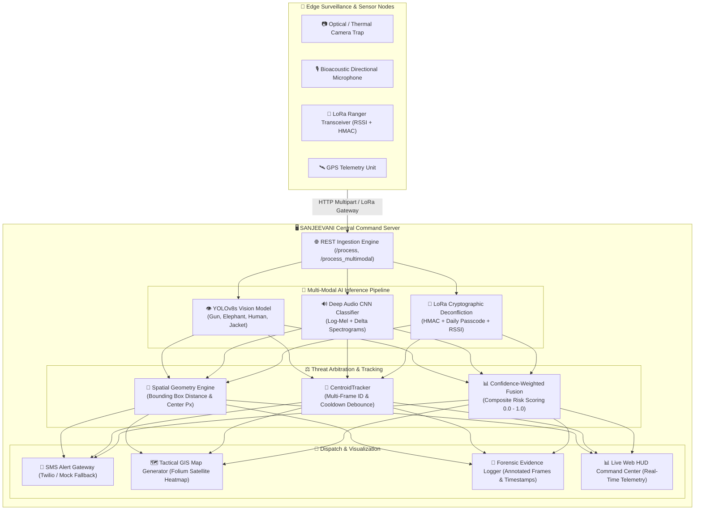
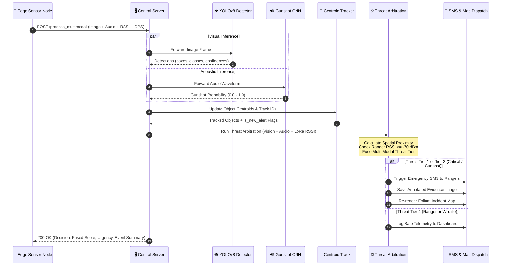
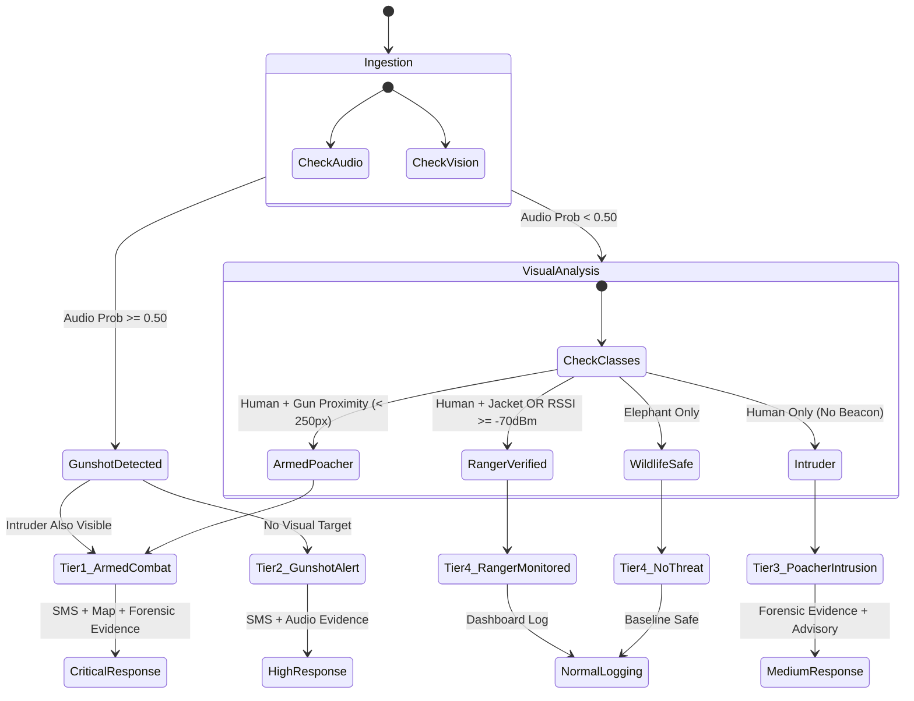

# 🏛️ SANJEEVANI System Architecture & Technical Design

## 1. High-Level System Architecture

---

## 2. Multi-Modal Processing & Threat Arbitration Sequence

---

## 3. Threat Arbitration Hierarchy

---

## 4. Multi-Frame Tracking & Debounce Mechanism

To eliminate duplicate SMS alerts when poachers remain in camera trap view for multiple seconds:

1. **Centroid Registration**: Detected bounding box centers $(C_x, C_y)$ are calculated.
2. **Euclidean Matching**: Minimum Euclidean distance matching links detections across successive frames.
3. **Alert Cooldown Window**: Each registered track ID maintains a `last_alert_time` timestamp. An alert is only dispatched if $\Delta t > \text{ALERT\_COOLDOWN\_SEC}$ (default: 30 seconds).
4. **Deregistration**: Objects absent for more than `MAX_DISAPPEARED` frames (default: 10 frames) are purged from memory.
